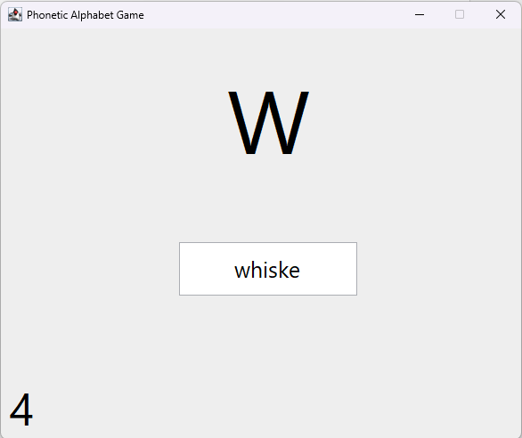

# Phonetic Alphabet Game

This Java program implements a simple game to practice recognizing and typing words from the NATO phonetic alphabet.

## Description

The program creates a graphical user interface using Swing that displays a random letter from A to Z. The user's task is to type a word from the NATO phonetic alphabet that starts with the displayed letter into a text field. If the typed word matches the letter and is part of the NATO phonetic alphabet, the program updates the score and displays a new random letter.

## Features

- Displays a random letter on the screen.
- Accepts user input to match the displayed letter with a word from the NATO phonetic alphabet.
- Tracks and displays the number of correct matches (hits).
- Simple and intuitive graphical user interface.

## Requirements

- Java Development Kit 22 (JDK)

## Usage

To compile and run the program, follow these steps:

1. Ensure you have Java Development Kit (JDK) installed on your system.
2. Open a terminal or command prompt.
3. Navigate to the directory where `Main.java` is located.
4. Compile the program by executing the following command:

    ```javac Main.java```


5. After successful compilation, run the program using the following command:

    ```java Main```

6. The program will open a window titled "Phonetic Alphabet Game" where you can start playing.

## Example



## License

This project is licensed under the [MIT License](LICENSE).
